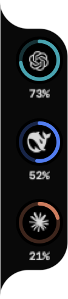

<div align="center">


# Token Tracker

### Your AI quotas, one glance away.

一眼查看 Codex、Claude、DeepSeek 等 AI 服务的剩余额度。

[](https://github.com/Evan1u/CodexBar/releases/tag/token-tracker-v0.56.3)
[](https://github.com/Evan1u/CodexBar/releases/tag/token-tracker-v0.56.3)
[](https://github.com/Evan1u/CodexBar/releases/tag/token-tracker-v0.56.3)

<br />

<a href="https://github.com/Evan1u/CodexBar/releases/tag/token-tracker-v0.56.3"><strong>Download Token Tracker →</strong></a>

</div>

<br />

<div align="center">



<sub><b>Rendered from the production SwiftUI components</b> · example data · shown at 2× for clarity</sub>

</div>

## What it does

- Shows each enabled provider in a slim floating side rail.
- Displays **remaining quota** directly around the provider icon.
- Opens a detail view with session, weekly, monthly, balance, and reset information when available.
- Reuses CodexBar's local provider integrations, authentication, refresh, and cache in-process.
- Keeps the original CodexBar menu available as a fallback.

## Install

1. Download [`Token-Tracker-v0.56.3-arm64.zip`](https://github.com/Evan1u/CodexBar/releases/download/token-tracker-v0.56.3/Token-Tracker-v0.56.3-arm64.zip).
2. Unzip and move **Token Tracker.app** to `/Applications`.
3. Open the app, then enable providers in **Settings → Providers**.

> This is an Apple Silicon pre-release build for macOS 14 or later. It is signed with an Apple Development certificate and is not notarized.

## Interaction

| Action | Result |
| --- | --- |
| Hover the rail | Reveals the full provider stack |
| Click a provider | Opens its quota detail view |
| Drag the rail | Repositions it along the screen edge |
| Open the original menu | Uses CodexBar's full provider interface |

## Build from source

Requires macOS 14+ and Swift 6.2+.

```bash
./Scripts/package_app.sh
open CodexBar.app
```

Development loop:

```bash
./Scripts/compile_and_run.sh
./Scripts/compile_and_run.sh --test
make check
```

## Credits

Token Tracker is built on [CodexBar](https://github.com/steipete/CodexBar) by Peter Steinberger and its contributors. The provider engine, settings, authentication flows, refresh logic, and fallback menu remain part of the upstream project.

## License

[MIT](LICENSE)
